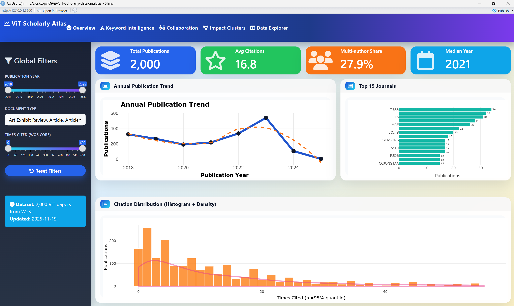
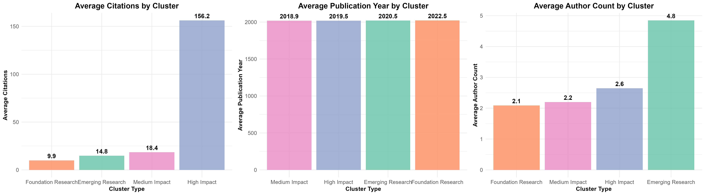
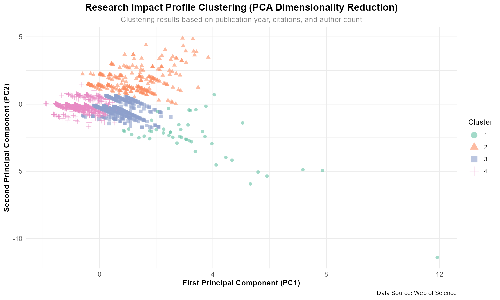

<h1 align="center">ViT Scholarly Atlas — Final Submission Report</h1>

<p align="center">
  
  <br/><br/>
  <a href="https://github.com/HIT-JimmyXiao/ViT-Scholarly-data-analysis"></a>
  <a href="https://bowenzhao917.shinyapps.io/vit-scholarly-dashboard/"></a>
  <a href="LICENSE"></a>
  <a href="#main-features-and-what-they-offer-to-users"></a>
</p>

---

## 📋 项目概述

本仓库实现“Vision Transformer 学术景观分析”全部流程：

- **数据源**：Web of Science (WoS) 导出的 2,000 条 ViT 相关文献（`savedrecs (1).xls` + `savedrecs (2).xls`）
- **分析工具**：R + tidyverse 生态（全部代码封装于 `submit/report_CN.Rmd` 与 `submit/report_EN.Rmd`）
- **核心输出**：年度趋势、期刊/国家画像、引用结构、关键词演化、合作网络、聚类建模等 6 大洞察模块

完整图像与 HTML 报告位于 `submit/visualization/` 及 `submit/output/`（可选）。

---

## 🗂️ 数据特征速览

| 指标 | 数值 | 说明 |
| --- | --- | --- |
| 文献总量 | 2,000 | 合并去重后 |
| 原始字段 | 79 列 | 含多国语言冗余字段 |
| 保留字段 | ≈22 列 | 移除缺失率 > 50% 字段 |
| 发表年份 | 2018-2025 | Q1=2019, Median=2021, Q3=2023 |
| 被引频次 (WoS Core) | 平均 12.13，最大 334 | 右偏分布 |
| 作者合作 | 平均 4.6 人 | 多作者协作主导 |

> 字段映射、缺失字段清单详见 `submit/README.md`。

---

## 📊 核心可视化

<p align="center">
  
  
  
</p>

> 想直接交互式查看全部模块（含 KPI、关键词智能、协作结构、3D 聚类曲面与数据表），请访问 **[https://bowenzhao917.shinyapps.io/vit-scholarly-dashboard/](https://bowenzhao917.shinyapps.io/vit-scholarly-dashboard/)**。

- 年度发表趋势

  

- Top 期刊贡献

  

- 被引分布与长尾结构

  

- 高频关键词谱系

  

- 关键词时间演化

  

- 作者合作与聚类画像

  

- 聚类特征、二维投影与 Shiny 截图：

  

  


---

## 🔍 主要洞察

1. **研究爆发期**：2022-2023 年发表量同比增长 60%+，2024-2025 年保持高位。
2. **跨学科渗透**：多媒体、通信、医学等期刊均有高频 ViT 文献，显示跨场景扩散。
3. **引用长尾**：引用呈显著右偏，Top 5% 文献贡献 30% 以上引用。
4. **关键词演替**：`attention`、`classification` 稳居核心，`medical`、`remote`、`scene` 等新兴领域快速升温。
5. **合作增益**：作者数量与被引频次正相关，跨机构协作显著提升影响力。
6. **聚类画像**：K-means + PCA 识别 4 类研究群体：高影响协同 / 新兴潜力 / 稳健中等 / 基础探索。

---

## 🧭 仓库结构

```
ViT-Scholarly-data-analysis/
├── app.R                        # Shiny 仪表板（与 Flash-Freeze 风格一致）
├── deployed.R                   # shinyapps.io 部署脚本
├── README.md / README_en.md     # 多语言说明（本文件）
├── report_CN.Rmd                # 中文 R Markdown 报告
├── report_EN.Rmd                # 英文 R Markdown 报告
├── savedrecs (1|2).xls          # Web of Science 原始数据
├── visualization/               # R Markdown 输出 + Shiny 截图（详见下文）
├── ViT-Scholarly-function_plot/ # 仪表板高清截图/补充静态图
└── LICENSE                      # MIT License
```

### 📁 visualization 目录说明

- `plot*_*.png`：`report_*.Rmd` 渲染出的标准图表，可直接引用到论文/幻灯片。
- `shiny_*.png`、`top-journals-1.png` 等：在线仪表板的高清截图，方便在 README 或发布稿中展示交互效果。
- 如需保持整洁，可将冗余旧图清理至归档分支，但本仓库默认保留全部静态素材，方便开源使用。

---

## ⚙️ 使用方式

```bash
git clone https://github.com/your-account/ViT-Scholarly-Atlas.git
cd ViT-Scholarly-Atlas

# 安装依赖
Rscript -e "install.packages(c('tidyverse','readxl','lubridate','scales','RColorBrewer','wordcloud','gridExtra','bslib','shinyWidgets','plotly','DT','wordcloud2'))"

# 渲染 R Markdown 报告
Rscript -e "rmarkdown::render('report_CN.Rmd')"
Rscript -e "rmarkdown::render('report_EN.Rmd')"

# 或启动交互式仪表板
Rscript -e "shiny::runApp('app.R')"
```

- `cluster-visualization` 代码块默认 `eval = FALSE`，避免 PCA 绘图卡顿；如需查看，可手动设置 `eval=TRUE`。

### 🌐 在线体验与部署

- **Shiny 仪表板** 已托管到 shinyapps.io，直接访问 👉 [https://bowenzhao917.shinyapps.io/vit-scholarly-dashboard/](https://bowenzhao917.shinyapps.io/vit-scholarly-dashboard/)。
- `app.R` 中的 `bs_theme`、KPI 卡片和 3D 聚类截面与 Flash-Freeze 框架保持一致，涵盖 Overview / Keyword Intelligence / Collaboration / Impact Clusters / Data Explorer 五大分屏。
- 如需自建部署，执行 `deployed.R` 即可通过 rsconnect 将同一套仪表板推送到个人 shinyapps.io 或 Posit Connect。

---

## 📌 版本规划

| 版本 | 日期 | 亮点 |
| --- | --- | --- |
| v1.0.0 | 2025-11-07 | 发布中英双语 R Markdown 与 6 套核心可视化 |
| v1.1.0 | (计划) | 引入 GitHub Actions 自动渲染、增加交互式仪表板 |

---

## 📜 许可证

本项目采用 [MIT License](LICENSE)。

---

## 📮 联系方式

- GitHub: [https://github.com/HIT-JimmyXiao](https://github.com/HIT-JimmyXiao)

欢迎 Issue / PR 互动交流，一起拓展 Vision Transformer 研究地图！


