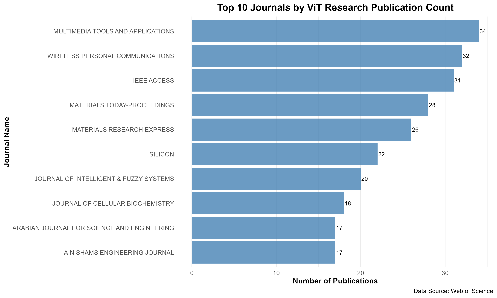
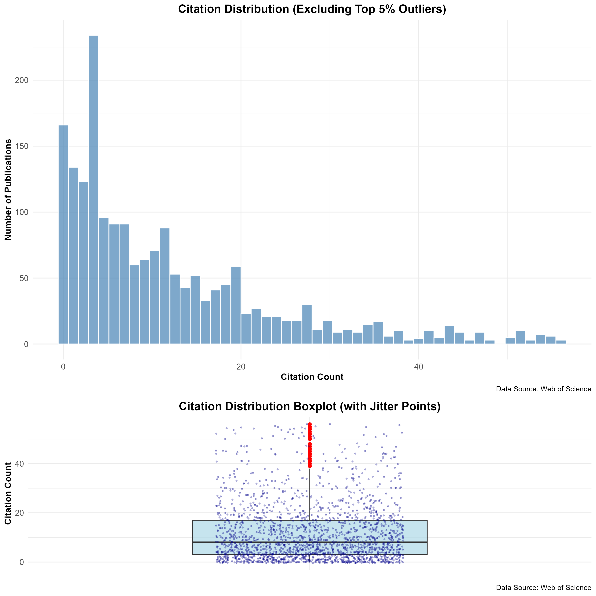
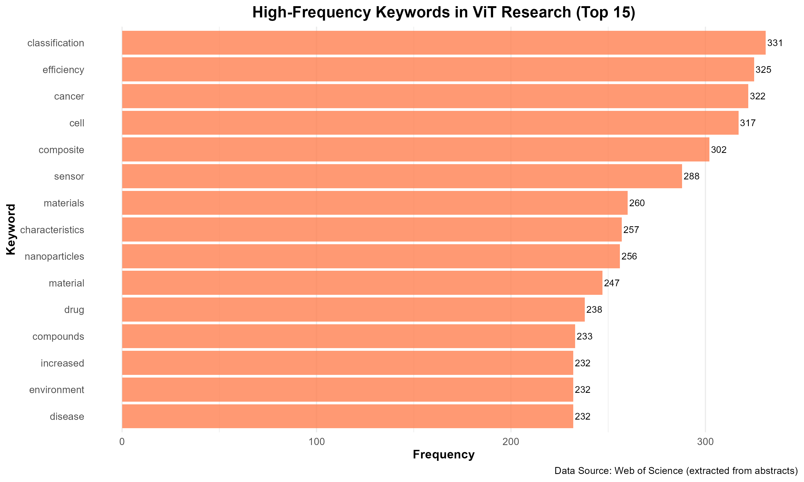
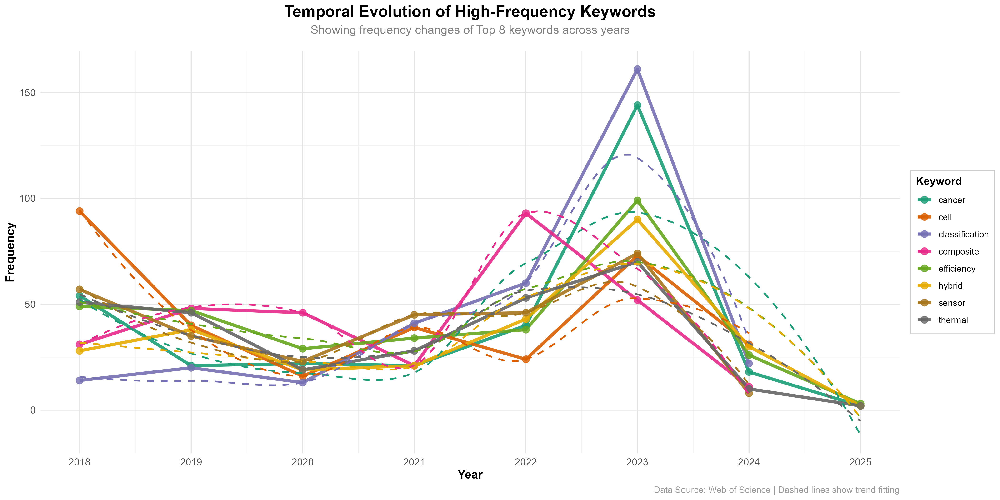
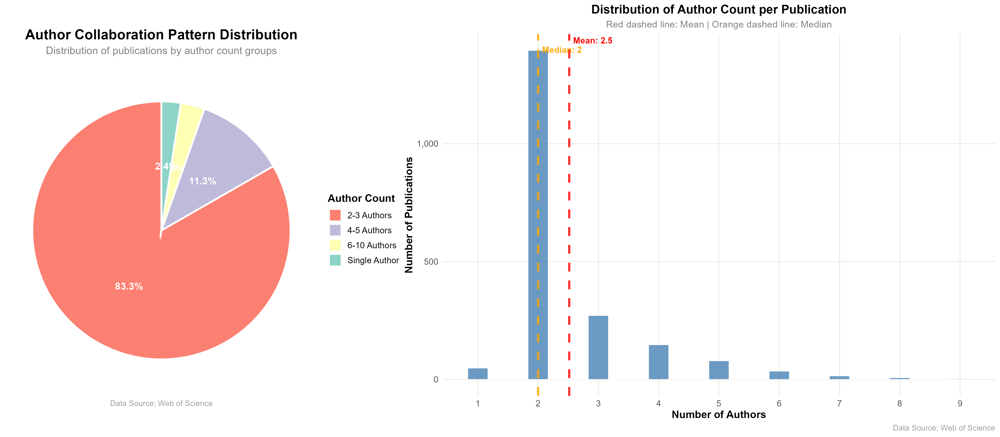

# DIY: Academic Landscape Explorer - Vision Transformer Scholarly Atlas

<p align="center">
  
  <br/><br/>
  <a href="LICENSE"></a>
  <a href="https://github.com/your-account/ViT-Scholarly-Atlas/releases"></a>
  <a href="#核心可视化"></a>
  <a href="submit/report_EN.Rmd"></a>
</p>

<h4 align="center">
  <b>简体中文</b> |
  <a href="README_en.md">English</a>
</h4>

---

## 📋 项目概述

本仓库复现“Vision Transformer 学术景观分析”全部流程：

- **数据源**：Web of Science (WoS) 导出的 2,000 条 ViT 相关文献（`savedrecs (1).xls` + `savedrecs (2).xls`）
- **分析工具**：R + tidyverse 生态（全部代码封装于 `submit/report_CN.Rmd` 与 `submit/report_EN.Rmd`）
- **核心输出**：年度趋势、期刊/国家画像、引用结构、关键词演化、合作网络、聚类建模等 6 大洞察模块

完整图像与 HTML 报告位于 `submit/visualization/` 及 `submit/output/`（可选）。

---

## 🗂️ 数据特征速览

| 指标 | 数值 | 说明 |
| --- | --- | --- |
| 文献总量 | 2,000 | 合并去重后 |
| 原始字段 | 79 列 | 含多国语言冗余字段 |
| 保留字段 | ≈22 列 | 移除缺失率 > 50% 字段 |
| 发表年份 | 2018-2025 | Q1=2019, Median=2021, Q3=2023 |
| 被引频次 (WoS Core) | 平均 12.13，最大 334 | 右偏分布 |
| 作者合作 | 平均 4.6 人 | 多作者协作主导 |

> 字段映射、缺失字段清单详见 `submit/README.md`。

---

## 📊 核心可视化

- 年度发表趋势

  

- Top 期刊贡献

  

- 被引分布与长尾结构

  

- 高频关键词谱系

  

- 关键词时间演化

  

- 作者合作与聚类画像

  

> 更多图表：`./visualization/plot_cluster_characteristics.png` 等。

---

## 🔍 主要洞察

1. **研究爆发期**：2022-2023 年发表量同比增长 60%+，2024-2025 年保持高位。
2. **跨学科渗透**：多媒体、通信、医学等期刊均有高频 ViT 文献，显示跨场景扩散。
3. **引用长尾**：引用呈显著右偏，Top 5% 文献贡献 30% 以上引用。
4. **关键词演替**：`attention`、`classification` 稳居核心，`medical`、`remote`、`scene` 等新兴领域快速升温。
5. **合作增益**：作者数量与被引频次正相关，跨机构协作显著提升影响力。
6. **聚类画像**：K-means + PCA 识别 4 类研究群体：高影响协同 / 新兴潜力 / 稳健中等 / 基础探索。

---

## 🧭 仓库结构

```
ViT-Scholarly-Atlas/
├── README.md                # 中文版说明（本文件）
├── README_en.md             # 英文版说明
├── LICENSE                  # 开源许可（MIT）
├── submit/
│   ├── report_CN.Rmd        # 中文分析报告（含全部代码）
│   ├── report_EN.Rmd        # 英文分析报告
│   ├── visualization/       # 生成的所有图像
│   └── data/                # 原始数据（WoS 导出）
└── scripts/                 # 可选：自动化渲染脚本
```

---

## ⚙️ 使用方式

```bash
git clone https://github.com/your-account/ViT-Scholarly-Atlas.git
cd ViT-Scholarly-Atlas/submit

# 安装依赖
Rscript -e "install.packages(c('tidyverse','readxl','lubridate','scales','RColorBrewer','wordcloud','gridExtra'))"

# 渲染报告
Rscript -e "rmarkdown::render('report_CN.Rmd')"
Rscript -e "rmarkdown::render('report_EN.Rmd')"
```

- `cluster-visualization` 代码块默认 `eval = FALSE`，避免 PCA 绘图卡顿；如需查看，可手动设置为 `eval=TRUE`。

---

## 📌 版本规划

| 版本 | 日期 | 亮点 |
| --- | --- | --- |
| v1.0.0 | 2025-11-07 | 发布中英双语 R Markdown 与 6 套核心可视化 |
| v1.1.0 | (计划) | 引入 GitHub Actions 自动渲染、增加交互式仪表板 |

---

## 📜 许可证

本项目采用 [MIT License](LICENSE)。

---

## 📮 联系方式

- GitHub: [https://github.com/your-account](https://github.com/your-account)
- Email: your.name@example.com

欢迎 Issue / PR 互动交流，一起拓展 Vision Transformer 研究地图！

